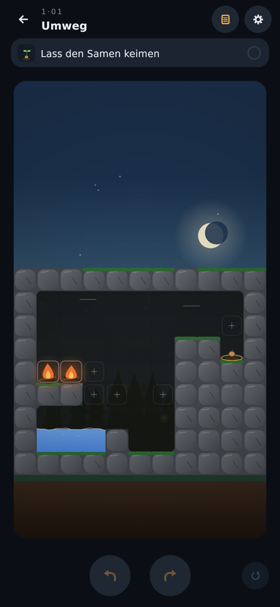
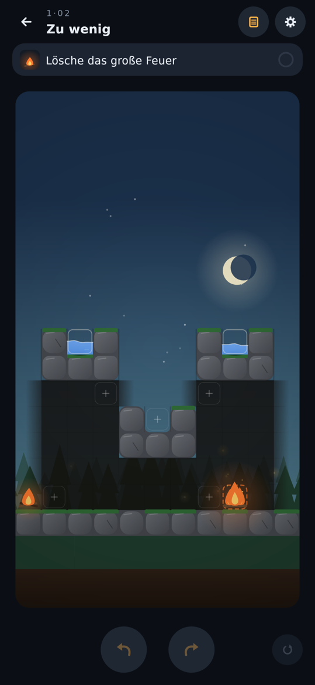
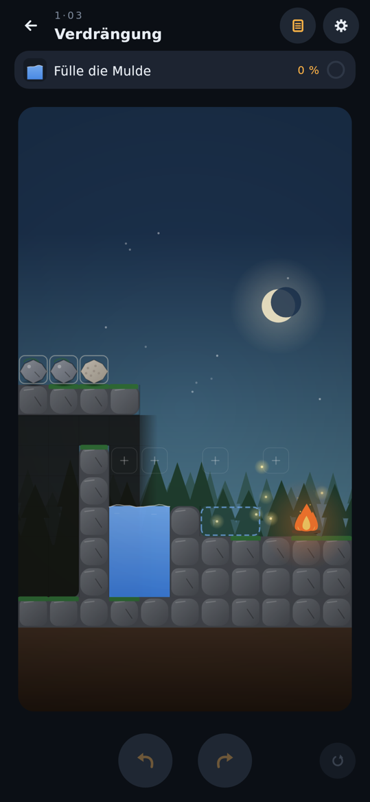
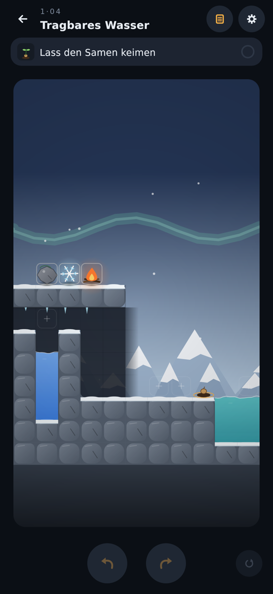
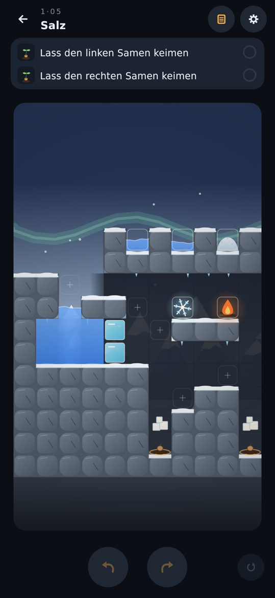
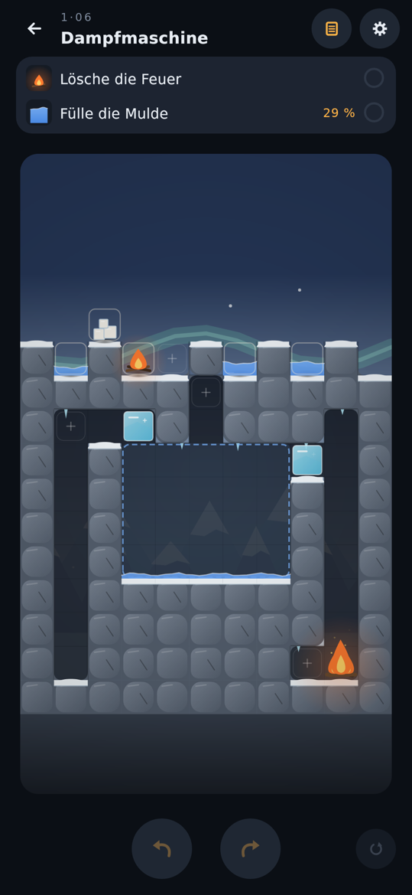
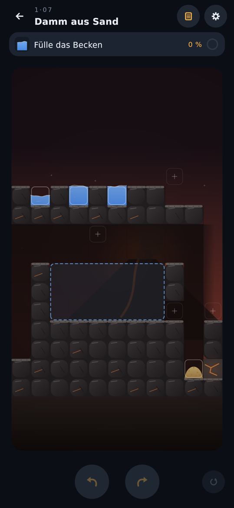
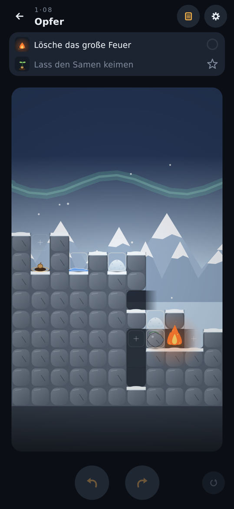

# Leveldesign: Welt „Prüfung“

Zehn Level nach dem Leitfaden: jedes hat genau eine Einsicht, eine Falle für den ersten Instinkt und ab Level 3 mindestens zwei Hebel für Tiefe. Alle Level nutzen Ablagefelder (`"placement": "marked"`). Die Kennzahlen kommen aus `DifficultyReportTest` (vollständige Suche, siehe README, Abschnitt „Schwierigkeit“).

## p_01 „Umweg“

- **Einsicht:** Wasser kommt nicht nur von unten: Als Dampf steigt es auf, wird unter der Decke zur Wolke und regnet dort, wohin kein Wasser fließen kann.
- **Falle:** Eine Flamme neben dem Samen verbrennt ihn. Eine einzelne Flamme am Teich verlischt und gibt zu wenig Dampf für eine Wolke. Ein großes Feuer direkt am Wasser wird gelöscht.
- **Lösung:** Die beiden Flammen zu einem großen Feuer verschmelzen und so auf die Mauer am Teich legen, dass seine Hitze das Wasser über eine Luftlücke erreicht. Der Dampf wird zur Wolke, der Wind treibt sie zum Samen.
- **Hebel:** Umnutzung (Feuer erzeugt hier Wasser), verzögerte Folgen (Dampf → Wolke → Wind → Regen).
- **Kennzahlen:** 2 Mindestzüge · 3 Lösungen · 44 % Sackgassen (4 von 9 ersten Zügen) · der naheliegende Zug (Flamme neben den Samen) führt nicht zur Lösung · Köder: keiner (erst ab Level 5 gefordert).

## p_02 „Zu wenig“

- **Einsicht:** Wasser muss erst gesammelt werden, bevor es reicht.
- **Falle:** Eine Pfütze (4 oder 3 Einheiten) direkt ans große Feuer verdampft wirkungslos, es braucht mindestens 6 auf einmal. Wer zuerst die kleine Flamme löscht, verbraucht 2 Einheiten, danach reichen beide zusammen nicht mehr. Wer die Pfützen auf flachem Boden zusammenlegt, verliert das Wasser an den Boden.
- **Lösung:** Eine Pfütze in die kleine Mulde in der Mitte tragen, die andere dazugießen (7 Einheiten), das gesammelte Wasser ans große Feuer.
- **Hebel:** Knappheit (7 Einheiten reichen genau, 5 nicht mehr), Reihenfolge (erst sammeln, dann gießen), Irreversibilität (verdampftes und versickertes Wasser ist weg).
- **Kennzahlen:** 3 Mindestzüge · 2 Lösungen · 75 % Sackgassen (6 von 8 ersten Zügen) · der naheliegende Zug (Pfütze ans Feuer) führt nicht zur Lösung · Köder: die kleine Flamme (fest, kein bewegliches Objekt).

## p_03 „Verdrängung“

- **Einsicht:** Ein Stein kann Wasser heben: was im Teich versinkt, schiebt das Wasser über den Rand in die höhere Mulde.
- **Falle:** Wer zuerst einen Stein in den Teich wirft, schickt den Überlauf an das große Feuer, das ihn verdampft; danach reicht das Wasser nicht mehr. Der Bimsstein im Teich schwimmt nur und hebt nichts. Ein Stein im Spalt vor dem Feuer fehlt danach im Teich.
- **Lösung:** Erst den Bimsstein in den Spalt zwischen Mulde und Feuer: er hält dort das Wasser und schirmt die Hitze ab. Dann beide Steine in den Teich.
- **Hebel:** Reihenfolge (Schild vor dem ersten Überlauf), Irreversibilität (verdampftes Wasser ist weg), Umnutzung (der Bimsstein, der nichts hebt, wird zum Hitzeschild).
- **Kennzahlen:** 3 Mindestzüge · 8 Lösungen (Reihenfolge der Steine und welches der beiden Felder über dem Teich) · 33 % Sackgassen (4 von 12) · der naheliegende Zug (ein Ding auf das Feld über der Mulde) führt nicht zur Lösung.
- **Abweichung vom Leitfaden:** Ein Stein kann ein Feuer in dieser Engine nicht ersticken (es gibt keine solche Regel). Stattdessen neutralisiert ein Gegenstand im Spalt das Feuer, weil feste Dinge die Strahlungshitze des großen Feuers aufhalten. Die Einsicht und die Falle bleiben gleich.

## p_04 „Tragbares Wasser“

- **Einsicht:** Gefrorenes Wasser kann man mitnehmen: Süßwasser, das am Frostkristall zu Eis wird, ist ein Block, den man über jede Mauer tragen und erst am Ziel wieder schmelzen kann.
- **Falle:** Der Samen liegt direkt am Meer, und seit p_03 weiß man, dass ein Stein Wasser hebt. Ein Stein im Meer hebt aber Salzwasser an den Samen und versalzt ihn. Eine Flamme direkt neben dem Samen verbrennt ihn, im Brunnen oder im Meer verlischt sie.
- **Lösung:** Den Stein in den Brunnen werfen, damit das Süßwasser bis unter das Feld steigt. Den Frost auf dieses Feld setzen: das oberste Wasser gefriert. Das Eis neben den Samen tragen und die Flamme auf der anderen Seite des Eises ablegen.
- **Hebel:** Reihenfolge (Stein und Frost brauchen dasselbe Feld über dem Brunnen; wer zuerst den Frost setzt, muss ihn wieder wegnehmen), Irreversibilität (verbrannter oder versalzener Samen, verloschene Flamme), Nebenwirkung (der Stein im Meer hebt das falsche Wasser), Umnutzung (der Stein hebt hier Wasser für den Frost, nicht für das Ziel).
- **Kennzahlen:** 4 Mindestzüge · 4 Lösungen (wann die Flamme kommt) · 33 % Sackgassen (4 von 12 ersten Zügen: Flamme in den Brunnen, ins Meer oder neben den Samen, Stein ins Meer) · der naheliegende Zug (ein Ding auf das Feld neben dem Samen) führt nicht zur Lösung · Köder: keiner (erst ab Level 5 gefordert).
- **Abweichung vom Leitfaden:** Der Frost steht nicht schon neben einem vollen Wasserfeld; erst der Stein hebt das Süßwasser im Brunnen bis an den Frost. Das ergibt den vierten Zug und die Falle mit dem Meer. Das Eis liegt neben statt über dem Samen: Schmilzt es über ihm, hebt das Wasser den gekeimten Samen an, und er treibt in die Flamme daneben (Samen schwimmen in dieser Engine).

## p_05 „Salz“

- **Einsicht:** Salz löst sich in dem auf, was es zuerst berührt: Trifft es Wasser, wird daraus Meerwasser; trifft es Schnee oder Eis, taut es daraus Süßwasser, und zwar genau dort, wo das Salz liegt.
- **Falle:** Über beiden Samen sitzt ein Salzpfropfen. Wer Wasser zu den Samen bringt (Pfütze auf das Feld daneben, Flamme an den Eisdamm, damit der Teich ausläuft), schickt es über das Salz: Meerwasser, beide Samen verdorren. Schnee in den linken Schacht ist verschwendet, denn rechts kommt nur Schnee an.
- **Lösung:** Die Pfütze in den Teichhals gießen, damit er voll ist, und den Frost darüber setzen: das oberste Wasser gefriert. Das Eis in den linken Schacht auf das Salz werfen. Den Schnee auf den Sims rechts legen; er rieselt hinunter auf das zweite Salz.
- **Hebel:** Irreversibilität (das Salz löst sich auf, verdorrte Samen bleiben verdorrt), Reihenfolge (erst den Teichhals füllen, dann frieren, dann das Eis tragen), Knappheit (ein Schnee, eine volle Wasserzelle für das Eis), Nebenwirkung (was der Teichhals nicht fasst, läuft über einen Gang bis auf die Salzpfropfen), Umnutzung (das Salz, das Wasser verdirbt, macht hier Süßwasser).
- **Kennzahlen:** 4 Mindestzüge · 8 Lösungen (nur die Reihenfolge variiert) · 50 % Sackgassen (12 von 24 ersten Zügen) · der naheliegende Zug (ein Ding auf das Feld zwischen den Samen) führt nicht zur Lösung, Wasser dort ist sofort verloren · Köder: die Flamme und die kleine Pfütze (3 Einheiten, sie füllt den Teichhals nicht).
- **Abweichung vom Leitfaden:** Ein bewegliches Salz taut in dieser Engine jeden Eisdamm mit einem einzigen Zug; Salz auf der Dammkrone berührt nur Eis. Damit wäre das Level ein Ein-Zug-Rätsel. Deshalb sind die Salze hier feste Pfropfen über den Samen, und Schnee und Eis müssen zu ihnen kommen. Die Einsicht („was es zuerst berührt“) bleibt, ebenso der Eisdamm mit der Flammen-Falle. Statt des Steins ist die kleine Pfütze der Köder: Ein Stein im Teichhals hätte dieselbe Wirkung wie die Pfütze und wäre kein Köder.

## p_06 „Dampfmaschine“

- **Einsicht:** Löschen erzeugt den Rohstoff für das nächste Ziel: Der Dampf eines gelöschten Feuers steigt durch den Kamin und taut das Eis, an das kein Feld heranreicht.
- **Falle:** Die kleine Flamme dort zu löschen, wo sie liegt, ist der erste Instinkt; ihr Dampf entweicht in den Himmel. Wasser direkt in die Mulde geht im Muldenwasser auf und fehlt danach. Eine Pfütze an das große Feuer verkocht nur (unter 6 Einheiten löscht es nicht): Ihr Dampf taut zwar Eis, aber das Feuer brennt weiter, und das Wasser ist weg.
- **Lösung:** Die Flamme in den linken Kamin werfen und die kleine Pfütze hinterher: Der Dampf taut die linke Eistür. Die beiden anderen Pfützen im Kaminfuß sammeln (6 Einheiten) und an das große Feuer gießen: Sein Dampf taut die rechte Eistür.
- **Hebel:** Umnutzung (Feuer und Löschwasser werden zur Dampfmaschine, der Kaminfuß zum Sammelbecken), Knappheit (genau 2 + 6 Einheiten, jede verschüttete Pfütze fehlt), Irreversibilität (verkochtes und in der Mulde versickertes Wasser ist weg), verzögerte Folgen (der Dampf wirkt erst oben im Kamin).
- **Kennzahlen:** 5 Mindestzüge · 32 Lösungen (Reihenfolge der beiden Hälften und welche Pfütze wohin; immer dieselbe Idee) · 45 % Sackgassen (9 von 20 ersten Zügen) · der naheliegende Zug (ein Ding auf das Feld neben die Flamme oder neben das große Feuer) führt nicht zur Lösung · Köder: das Salz (es taut Eis, aber kein Feld führt zum Eis; in der Mulde versalzt es das Wasser).
- **Abweichung vom Leitfaden:** Zwei Feuer und zwei Eistüren statt je einem. Der Dampf eines einzelnen Löschens verteilt sich in dieser Engine und taut dabei mehrere Eisblöcke, und Dampf, der oben unter der Decke ankommt, wird schon ab 8 Einheiten zur Wolke, bevor er das Eis berührt. Deshalb sitzt jede Eistür an einem eigenen Kamin, und die Tür am großen Feuer hängt seitlich am Kamin, wo der Dampf beim Aufsteigen vorbeizieht.

## p_07 „Damm aus Sand“

- **Einsicht:** Wasser an der falschen Stelle ist nützlich, wenn es etwas abdichtet: Erst nasser Sand hält; trockener rieselt durch jede Lücke.
- **Falle:** Der naheliegende Zug ist der trockene Sand direkt in die Lücke des Beckens: Er rieselt hindurch und landet wieder unten am Glutfels. Wer den Sand dort unten nass macht, verliert das Wasser, denn der Glutfels trocknet ihn sofort wieder. Wer zuerst Wasser ins Becken gießt, verliert es durch die Lücke. In die Befeuchtungsmulde gegossenes Wasser ohne Sand darin läuft ab.
- **Lösung:** Den Sand in die Mulde oben rechts legen und die kleine Pfütze darüber gießen; der nasse Sand klebt. Ihn in die Lücke setzen, dann die beiden großen Pfützen ins Becken.
- **Hebel:** Reihenfolge (erst nass machen, dann dichten, dann füllen), Umnutzung (die kleine Pfütze gehört nicht ins Becken, sie macht den Sand nass), Nebenwirkung (der Glutfels trocknet nassen Sand in seiner Nähe), Knappheit (4 + 8 + 8 Einheiten: jedes verschüttete Wasser fehlt).
- **Kennzahlen:** 5 Mindestzüge · 4 Lösungen (wo der Sand nass wird, Reihenfolge der großen Pfützen) · 50 % Sackgassen (3 von 6 verschiedenen ersten Zügen; alle verschütteten Pfützen enden gleich, am Glutfels verdampft) · der naheliegende Zug (der Sand in die Lücke neben dem Becken) führt nicht zur Lösung · Köder: die kleine Pfütze (anders eingesetzt als offensichtlich).
- **Abweichung vom Leitfaden:** Keine Lava und kein Baum. Lava ist in dieser Engine eine gewöhnliche Flüssigkeit, die jeder feste Gegenstand aufhält; trockener Sand vor der Lava würde zu Glas und hielte sie auf, das Wasser wäre unnötig. Außerdem muss jedes Level in Ruhe beginnen, und es gibt kein Element, mit dem der Spieler eine Lava erst freilassen könnte, ohne dass derselbe Gegenstand sie auch aufhält. Die Einsicht und die Fallen (trockener Sand hält nicht, Sand am Glutfels trocknet wieder) sind geblieben; das Ziel ist ein Becken statt eines Baums.

## p_08 „Opfer“

- **Einsicht:** Das Feuer ist selbst die Wasserquelle. Seine Hitze schmilzt den Schnee, aber man muss etwas aufgeben, um mehr zu bekommen: Der einzige Tropfen beim Samen wird zum Gefäß, und die Tür zum Feuer geht nur auf, wenn man den Schnee darauf vorher in Sicherheit bringt.
- **Falle:** Der naheliegende Zug ist das einzige Wasser direkt ans Feuer; ein Tropfen verdampft sofort, und mit ihm ist auch der Stern weg. Schnee ans Feuer verdampft genauso. Wer die Steintür zuerst öffnet, lässt den Schnee darauf ins Feuer fallen. Wer Schnee bei geschlossener Tür in die Mulde wirft, bekommt kein Wasser: Er fällt kalt in den Schacht.
- **Lösung:** Den Schnee von der Tür in den Schacht legen und den Tropfen darauf gießen. Die Tür auf das Samenfeld stellen; jetzt reicht die Hitze bis zur Mulde. Beide Schneehaufen dort schmelzen lassen; das Schmelzwasser läuft in den Tropfen, bis er 7 Einheiten hat. Dann ans Feuer. Für den Stern den Tropfen vorher einmal über den Samen gießen; er keimt, und das Wasser bleibt beweglich.
- **Hebel:** Reihenfolge (Gefäß vor Hitze, Schnee von der Tür vor dem Öffnen), Umnutzung (das Wasser des Samens löscht nicht, es fängt auf), Nebenwirkung (die offene Tür macht die Mulde heiß, das Feuer schmilzt den Schnee), Reichweite (die Hitze geht zwei Felder weit; Wasser im tiefen Schacht bleibt kühl), Knappheit (1 + 3 + 3 Einheiten, das Feuer braucht 6 auf einmal).
- **Kennzahlen:** 6 Mindestzüge · 9 Lösungen (wo der Schnee von der Tür wartet, wohin der Stein kommt, welcher Schnee zuerst schmilzt) · 50 % Sackgassen (6 von 12 verschiedenen ersten Zügen) · der naheliegende Zug (das Wasser auf das Feld neben dem Feuer) führt nicht zur Lösung · Köder: der Tropfen beim Samen (anders eingesetzt als offensichtlich).
- **Abweichung vom Leitfaden:** Kein Holz. In dieser Engine löscht Schmelzwasser brennendes Holz sofort (2 Einheiten), sodass Holz als Wärmeträger zum Schnee nur Wasser kostet. Als bloßer Köder senkte es den Anteil der Sackgassen unter 50 %, weil jeder Zug damit harmlos ist. Die Köderrolle übernimmt das Wasser des Samens. Gegenstände können nicht auf einem Ablagefeld beginnen; der Schnee liegt deshalb auf der Steintür vor dem Feuer und in einer Nische statt auf den Feldern. Der Stern kostet nichts, wenn man den Samen zuerst gießt; die Falle (das Wasser fürs Feuer nehmen) kostet Stern und Level.
