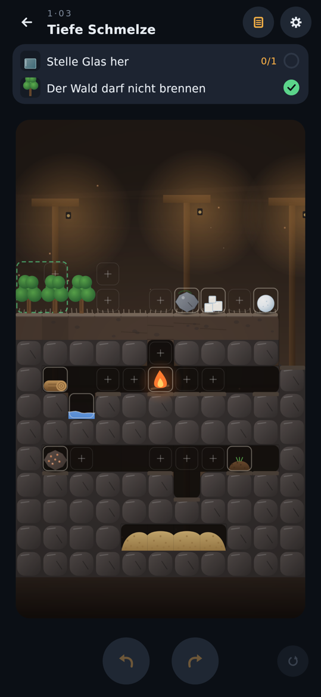

# Leveldesign: Welt „Test“

Drei Testlevel nach Leitfaden V2 (`LEITFADEN_REACT_V2.md`): ein leichtes Level, eines aus der Mitte des Spiels und eines an der Obergrenze, jedes aus einem anderen Gebiet. Pro Level: Einsicht, Fallen, Köder, Kette der Reaktionen, Kennzahlen und Startbild. Die früheren Level p_01 … p_10 stehen in der Git-Historie.

Kennungen in den Musterlösungen: Dinge heißen nach Typ und Startfeld (`fire_0_4`); was die Welt erzeugt, bekommt eine laufende Nummer (`charcoal#1`). Eine Verschmelzung behält die Kennung des Ziels: Feuer auf `charcoal#1` ergibt Glut mit der Kennung `charcoal#1`.

## t_01 „Kochstelle“ (Wald, leicht)

**Einsicht:** Glut erhitzt, ohne zu zünden.

**Ziele:** Bring das Wasser im Becken zum Kochen (`heat`, Becken (7,7)–(7,8)). Der Wald darf nicht brennen (`preserve`, beide Bäume).

**Material:** ein Holzstück, ein Lagerfeuer, eine kleine Pfütze in einer Mulde. Die Pfütze hat 2 Einheiten Wasser und reicht für genau ein Löschen (Löschen verbraucht 2 Einheiten; was weniger hat, löscht nicht).

**Karte:** oben eine Lichtung mit Lagerfeuer, Felsbrocken, Holz und der Mulde; darunter am Waldrand das Becken, ein schmaler Brunnen. Es ist nur über ein einziges Ablagefeld erreichbar, und das grenzt an den ersten Baum.

**Kette:** Feuer neben das Holz, das Holz brennt (2 Züge). Die Pfütze daneben löscht es zu Holzkohle. Feuer auf die Holzkohle ergibt Glut. Glut aufs Feld am Becken bringt das Wasser zum Kochen; der Baum daneben bleibt grün.

**Musterlösung (4 Züge):** `fire_0_4@5,4` (Feuer rechts ans Holz), `water_3_5@3,4` (Pfütze links ans brennende Holz), `fire_0_4@4,4` (Feuer auf die Holzkohle), `charcoal#1@7,6` (Glut ans Becken).

**Fallen** (je ein Test in `TrapsTest`):
- *Feuer direkt ans Becken:* Das Wasser löscht es, aber im selben Schritt steckt es den Wald an. Danach unlösbar.
- *Zu spät gelöscht:* Holz anzünden und im nächsten Zug etwas anderes tun. Am Ende dieses Zuges ist es Asche, Brennstoff gibt es keinen mehr. Danach unlösbar.
- *Pfütze löscht die Flamme statt des Holzes:* Pfütze aufs Feld über der Feuerstelle. Das Feuer ist weg, das Holz verbrennt. Gleich wirkt das Feuer auf dem Feld über der Mulde oder die Pfütze auf dem Feld über dem Lagerfeuer.
- Weitere Sackgassen ohne eigenen Test: Pfütze ins Becken kippen (Löschwasser weg) oder brennendes Holz ins Becken (löscht, steckt aber den Wald an).

**Köder:** kein eigenes Köder-Objekt, das Material ist genau abgezählt. Der Köder ist das Feld am Becken: Dort will man das Feuer hinstellen.

**Ablagefelder:** 8 bei 4 Zügen (2 pro Zug). Falsch-Felder:
- am Becken (für das Feuer);
- über der Mulde (Feuer dort wird gelöscht);
- über der Feuerstelle rechts vom Holz (Pfütze dort löscht die Flamme);
- über dem Lagerfeuer (Pfütze dort löscht das Feuer).

Das Feld am Becken ist das einzige direkt am Hauptziel; es ist die Falle für das Feuer und zugleich der Platz für die Glut.

**Kennzahlen (DifficultyReport):**
- Mindestzüge 4, durch vollständige Suche bewiesen.
- 18 Lösungen mit 4 Zügen. Alle sind Spielarten derselben Kette: andere Reihenfolge, anderer Ort zum Anzünden, oder die Holzkohle ans Becken tragen und dort das Feuer drauflegen.
- 26 % der ersten Züge (5 von 19) führen in eine Sackgasse.
- Der naheliegende Zug, irgendetwas aufs Feld am Becken, führt nicht zur Lösung.

**Ehrlichkeitsprüfung:**
- *Kürzer?* Nein: Die vollständige Suche findet mit 3 Zügen keine Lösung.
- *Offensichtlicher?* Nein. Feuer und brennendes Holz bringen Wasser nicht zum Kochen, und jede Flamme am Becken steckt den Wald an. Ohne Flamme heiß ist nur Glut.
- Die Abkürzung „brennendes Holz im Becken löschen“ ist versperrt, weil das einzige Feld am Becken neben dem Wald liegt.

**Erwartung:** gelöst in etwa einer Minute.

## t_02 „Süßwasser“ (Küste, Mitte)

**Einsicht:** Verdunsten entsalzt. Dampf aus Salzwasser regnet als Süßwasser ab.

**Ziele:** Fülle das Becken auf der Klippe mit Süßwasser (`fill` mit `"full": true`, Becken (6,10)–(7,10), 16 Einheiten, kein Salzwasser darin). Die Hütte am Strand darf nicht brennen (`preserve`).

**Material:**
- das Meer unten links (Salzwasser, fest);
- eine bewegliche Salzwasser-Pfütze in einer Mulde (2 Einheiten, genau ein Löschen);
- ein Holzstück, das auf dem Dach der Hütte liegt;
- ein Lagerfeuer;
- Erde als Köder;
- eine Felsdecke über der Grotte (der Überhang) und Wind von links Richtung Klippe.

**Karte:** oben eine Wiese auf der Felsdecke mit Feuer, Pfütze und Erde. Darunter die Grotte: links Strand mit Hütte und Meer, rechts die Klippe mit dem Becken. Das Meer ist nur über ein Feld am Strand erreichbar, und das grenzt an die Hütte. Das Feld am Becken liegt auf der Klippenkante neben dem Becken: Flüssiges läuft von dort hinein, Festes bleibt oben liegen.

**Kette:**
1. Das Holz von der Hütte weg auf die Wiese tragen und anzünden.
2. Mit der Salzwasser-Pfütze löschen: Holzkohle.
3. Feuer auf die Holzkohle: Glut.
4. Glut aufs Feld am Meer. Sie kocht das Meer, ohne die Hütte anzuzünden.
5. Der Dampf steigt unter die Felsdecke und wird zur Wolke. Der Wind treibt sie zur Klippe, bis die Wand sie aufhält; dort regnet sie Süßwasser ins Becken.

**Musterlösung (5 Züge):** `wood_0_9@3,5`, `fire_0_5@2,5`, `seawater_5_6@4,5`, `fire_0_5@3,5`, `charcoal#1@1,10`. Nach dem letzten Zug dauert es gut 40 Schritte, bis das Becken voll ist.

**Fallen** (je ein Test in `TrapsTest`):
- *Salzwasser-Pfütze ins Becken:* Sie läuft hinein und verteilt sich. Glut oder Flamme kommen nicht an das Becken heran, also bleibt das Salzwasser für immer. Danach unlösbar (bis Rückgängig).
- *Feuer ans Meer:* Das Meer löscht es, aber vorher steckt es die Hütte an. Danach unlösbar.
- *Erde und Pfütze zu Schlamm:* Das einzige Löschwasser ist verbraucht. Danach unlösbar.
- Weitere Sackgassen ohne eigenen Test:
  - das Holz auf dem Hüttendach anzünden (Hütte brennt);
  - die Pfütze aufs Feld über dem Lagerfeuer (löscht das Feuer);
  - Erde ins Meer (Schlamm statt Meer am Strandfeld).

**Köder:** die Erde (in keiner Lösung benutzt). Dazu das Feld am Becken, das zum Hineinkippen der Pfütze einlädt.

**Ablagefelder:** 10 bei 5 Zügen (2 pro Zug). Falsch-Felder:
- an der Klippe (für die Pfütze);
- am Strand (für das Feuer);
- über dem Holz an der Hütte (zum Anzünden);
- auf dem Felsbrocken neben dem Lagerfeuer (Pfütze dort löscht das Feuer).

**Kennzahlen (DifficultyReport):**
- Mindestzüge 5, durch vollständige Suche bewiesen.
- 21 Lösungen mit 5 Zügen, alle mit derselben Kette: Holz weg von der Hütte, anzünden, mit der Pfütze löschen, Glut machen, Glut ans Meer.
- 19 % der ersten Züge (7 von 36) führen in eine Sackgasse.
- Der naheliegende Zug, etwas aufs Feld am Strand, führt nicht zur Lösung.

**Ehrlichkeitsprüfung:**
- *Kürzer?* Nein: Die vollständige Suche findet mit 4 Zügen keine Lösung.
- *Offensichtlicher?* Nein. Süßwasser gibt es im Level nicht. Das Löschen von brennendem Holz am Meer gibt nur 4 Einheiten Dampf, für eine volle Wolke braucht es 16. Nur dauerhaftes Kochen des Meeres füllt das Becken, und dauerhaft heiß ohne Flamme ist nur Glut.
- Zwei Abkürzungen aus früheren Entwürfen sind versperrt:
  - Kein zweites Feld liegt über dem Meer. Sonst ließe sich brennendes Holz dort ohne die Pfütze löschen, und die Glut läge gleich am Meer.
  - Kein Feld liegt direkt über dem Becken. Sonst könnte man dort Holz anzünden und mit genau der hineingekippten Pfütze löschen; die Salz-Falle wäre dann umkehrbar.

**Erwartung:** einige Minuten Nachdenken.

## t_03 „Tiefe Schmelze“ (Mine, Obergrenze)

**Einsicht in zwei Teilen:** Metall leitet Hitze durch die Wand. Und es gibt nur eine Flamme: Alles, was angezündet werden muss, muss brennen, bevor das Feuer zu Glut wird.

**Ziele:** Stelle Glas her (`produce`, mindestens 1 Glas). Der Wald darf nicht brennen (`preserve`, die zwei Bäume oben links).

**Material:**
- ein Baum am Waldrand und ein Stein;
- ein zweites Holzstück, Erz, ein Lagerfeuer;
- eine Pfütze (2 Einheiten) und ein Schneeball;
- als Köder Salz und Erde.

**Karte:**
- Oben: Wald, Randbaum, Stein, Salz und der Schneeball an der Kante eines Schachts.
- Darunter ein Stollen mit dem Lagerfeuer, dem zweiten Holz und der Pfütze in einer Nische.
- Tiefer ein Stollen mit Erz, Erde und dem Feld über dem Wandschlitz.
- Ganz unten die geschlossene Sandkammer. Keine Hitzequelle kommt hinein. Der Schlitz nimmt einen Block auf; zwischen ihm und dem Sand liegt eine Wandzelle.

**Kette:**
1. Stein auf den Randbaum: Holz. Der Stein bleibt liegen.
2. Das Holz vom Waldrand weg ans Lagerfeuer: Es brennt.
3. Die Pfütze daneben löscht es zu Holzkohle.
4. Das zweite Holz ans Feuer: Es brennt.
5. Der Schneeball daneben schmilzt in der Hitze; sein Wasser löscht das Holz im selben Zug.
6. Feuer auf die eine Holzkohle: Glut.
7. Erz auf die andere: Schmelzgut.
8. Schmelzgut in den Schlitz.
9. Glut darauf. Das Schmelzgut wird zu Metall, das Metall wird heiß, seine Hitze geht durch die Wand und schmilzt den Sand dahinter zu Glas.

**Musterlösung (9 Züge):** `stone_6_4@2,4`, `tree_2_4@4,7`, `water_2_8@3,7`, `wood_1_7@6,7`, `snow_9_4@7,7`, `fire_5_7@4,7`, `ore_1_10@6,7`, `charcoal#7@6,10`, `charcoal#1@6,10`. Das gefällte Holz behält die Kennung des Baums; das Schmelzgut heißt nach der Holzkohle, auf die das Erz fiel.

**Fallen** (je ein Test in `TrapsTest`):
- *Glut zu früh:* Feuer auf die erste Holzkohle, bevor das zweite Holz brennt. Danach gibt es keine Flamme mehr, das zweite Holz zündet nie. Ohne zweite Holzkohle kein Schmelzgut, also kein Metall.
- *Randbaum anzünden:* Feuer neben den Randbaum, und der Wald brennt mit.
- *Salz auf den Schneeball,* um Wasser zu gewinnen: Das Schmelzwasser läuft in den Schacht. Es bleibt nur die Pfütze, aber zwei Hölzer müssen gelöscht werden.
- *Erde und Pfütze zu Schlamm:* Es bleibt nur der Schneeball zum Löschen.
- *Beide Hölzer gleichzeitig brennen lassen:* Im nächsten Zug lässt sich nur eines löschen, das andere zerfällt zu Asche.
- Ohne eigenen Test, aber gleich endgültig: einen Baum des Waldes fällen (der Wald ist dann nicht mehr ganz).

**Köder:** Salz (lockt mit „Salz taut Schnee“) und Erde (lockt mit der Pfütze daneben). Dazu das Feld neben dem Schlitzfeld: Glut dort liegt „neben dem Schlitz“, berührt das Schmelzgut aber nicht.

**Ablagefelder:** 14 bei 9 Zügen (1,6 pro Zug). Falsch-Felder:
- neben dem Randbaum (für das Feuer);
- über dem Wald (Stein auf einen Waldbaum);
- über dem Lagerfeuer (Pfütze oder Schneeball dort löschen die einzige Flamme);
- neben dem Schneeball (für das Salz);
- neben dem Schlitzfeld (für die Glut).

**Kennzahlen (DifficultyReport):**
- Mindestzüge 9. Vollständig durchsucht und bewiesen: keine Lösung mit bis zu 4 Zügen. Das zeigen zwei unabhängig geschriebene Suchen: der Test (`LevelAnalysis.shortestWithin`) und ein zweites Werkzeug, das pro Ebene nur Zugfolgen und Prüfsummen hält (10,7 Millionen simulierte Züge, 7 Minuten).
- 0 von 3000 Zufallsspielen mit 12 Zügen lösen das Level.
- Eine vollständige Suche bis 6 Züge, wie der Leitfaden sie vorsieht, ist nicht machbar. Die Zahl der verschiedenen Welten wächst pro Zug um den Faktor 25 bis 45: 96, 4 271 und 108 364 nach einem bis drei Zügen. Hochgerechnet wären es nach 5 Zügen einige zehn Millionen Welten; Tiefe 6 hieße mehrere Milliarden zu simulierende Züge.
- Zusätzlich vollständig geprüft: Nach den ersten vier Zügen der Musterlösung gibt es keinen Rest in 4 Zügen, nach den ersten fünf keinen in 3.

**Warum es keine Lösung unter 9 Zügen gibt (Zählbegründung):**
1. *Zwei Holzkohlen nötig:* Glut und Schmelzgut verbrauchen je eine. Holz gibt es zweimal: das zweite Holzstück und den Randbaum. Der Randbaum lässt sich nicht als Baum anzünden und löschen, weil der Wald im nächsten Schritt mitbrennt. Also muss er gefällt werden (1 Zug).
2. *Beide Hölzer müssen bewegt werden:* Das gefällte Holz liegt am Waldrand und muss weg, bevor es brennt. Neben dem zweiten Holz liegt kein Feld, also kann man das Feuer nicht zu ihm bringen (2 Züge, die zugleich anzünden können).
3. *Zwei Löschzüge:* Jede Wasserquelle löscht nur einmal (Pfütze 2 Einheiten, Schneeball 3). Kein Zug zündet an und löscht zugleich mit Wasser, das erst bewegt werden muss (2 Züge).
4. *Zwei Verschmelzungen:* Feuer auf Holzkohle und Erz auf Holzkohle (2 Züge).
5. *Zwei Platzierungen:* Schmelzgut in den Schlitz und Glut darauf. Was nicht an Ort und Stelle entsteht, muss getragen werden. Heißes Metall lässt sich nicht tragen (2 Züge).

Zusammen sind das 9 Züge.

**Ehrlichkeitsprüfung.** Drei Abkürzungen hat der Bau aufgedeckt; alle sind beseitigt:
- *Pfütze löscht zwei Hölzer:* Eine Pfütze zwischen zwei brennenden Hölzern löschte beide. Die Engine zieht den Verbrauch jetzt vor dem zweiten Löschen ab: Was weniger als 2 Einheiten hat, löscht nicht.
- *Gesalzenes Schmelzwasser bleibt brauchbar:* Gesalzener Schnee hinterließ Schmelzwasser, das sich zu 2 Einheiten zusammenschieben ließ. Jetzt ist es ein formfester Schneeball an der Schachtkante; sein Schmelzwasser läuft unerreichbar in den Schacht.
- *Heißes Metall tragen (8 statt 9 Züge):* Schmelzgut ließ sich gleich neben der frischen Glut zu Metall schmelzen und das heiße Metall in den Schlitz tragen. Jetzt gilt: Glühendes Metall kann man nicht anfassen, erst abgekühlt wieder.
- *Offensichtlicher?* Die erste Idee, Glut oder Feuer in den Schlitz, schmilzt nichts, denn nur Metall gibt Hitze durch die Wand. Die zweite Idee, zuerst Glut zu machen, verbrennt die einzige Flamme zu früh.

**Erwartung:** zehn Minuten oder mehr, ohne unfair zu wirken.

