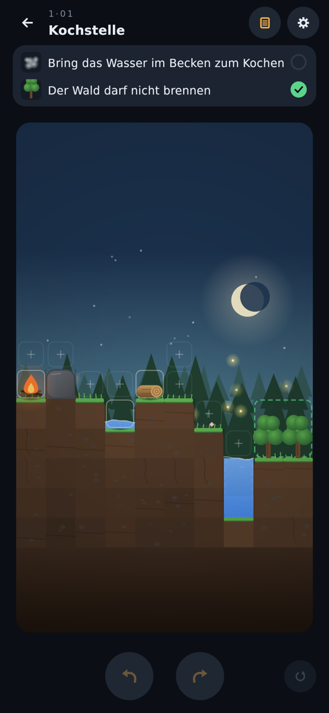
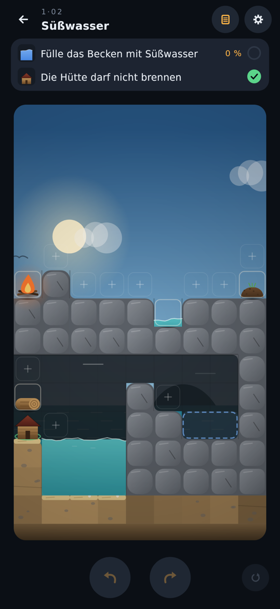

# Leveldesign: Welt „Test“

Drei Testlevel nach Leitfaden V2 (`LEITFADEN_REACT_V2.md`): ein leichtes Level, eines aus der Mitte des Spiels und eines an der Obergrenze, jedes aus einem anderen Gebiet. Pro Level: Einsicht, Fallen, Köder, Kette der Reaktionen, Kennzahlen und Startbild. Die früheren Level p_01 … p_10 stehen in der Git-Historie.

Kennungen in den Musterlösungen: Dinge heißen nach Typ und Startfeld (`fire_0_4`); was die Welt erzeugt, bekommt eine laufende Nummer (`charcoal#1`). Eine Verschmelzung behält die Kennung des Ziels: Feuer auf `charcoal#1` ergibt Glut mit der Kennung `charcoal#1`.

## t_01 „Kochstelle“ (Wald, leicht)

**Einsicht:** Glut erhitzt, ohne zu zünden.

**Ziele:** Bring das Wasser im Becken zum Kochen (`heat`, Becken (7,7)–(7,8)). Der Wald darf nicht brennen (`preserve`, beide Bäume).

**Material:** ein Holzstück, ein Lagerfeuer, eine kleine Pfütze in einer Mulde. Die Pfütze hat 2 Einheiten Wasser und reicht für genau ein Löschen (Löschen verbraucht 2 Einheiten; was weniger hat, löscht nicht).

**Karte:** oben eine Lichtung mit Lagerfeuer, Felsbrocken, Holz und der Mulde; darunter am Waldrand das Becken, ein schmaler Brunnen. Es ist nur über ein einziges Ablagefeld erreichbar, und das grenzt an den ersten Baum.

**Kette:** Feuer neben das Holz, das Holz brennt (2 Züge). Die Pfütze daneben löscht es zu Holzkohle. Feuer auf die Holzkohle ergibt Glut. Glut aufs Feld am Becken bringt das Wasser zum Kochen; der Baum daneben bleibt grün.

**Musterlösung (4 Züge):** `fire_0_4@5,4` (Feuer rechts ans Holz), `water_3_5@3,4` (Pfütze links ans brennende Holz), `fire_0_4@4,4` (Feuer auf die Holzkohle), `charcoal#1@7,6` (Glut ans Becken).

**Fallen** (je ein Test in `TrapsTest`):
- *Feuer direkt ans Becken:* Das Wasser löscht es, aber im selben Schritt steckt es den Wald an. Danach unlösbar.
- *Zu spät gelöscht:* Holz anzünden und im nächsten Zug etwas anderes tun. Am Ende dieses Zuges ist es Asche, Brennstoff gibt es keinen mehr. Danach unlösbar.
- *Pfütze löscht die Flamme statt des Holzes:* Pfütze aufs Feld über der Feuerstelle. Das Feuer ist weg, das Holz verbrennt. Gleich wirkt das Feuer auf dem Feld über der Mulde oder die Pfütze auf dem Feld über dem Lagerfeuer.
- Weitere Sackgassen ohne eigenen Test: Pfütze ins Becken kippen (Löschwasser weg) oder brennendes Holz ins Becken (löscht, steckt aber den Wald an).

**Köder:** kein eigenes Köder-Objekt, das Material ist genau abgezählt. Der Köder ist das Feld am Becken: Dort will man das Feuer hinstellen.

**Ablagefelder:** 8 bei 4 Zügen (2 pro Zug). Falsch-Felder:
- am Becken (für das Feuer);
- über der Mulde (Feuer dort wird gelöscht);
- über der Feuerstelle rechts vom Holz (Pfütze dort löscht die Flamme);
- über dem Lagerfeuer (Pfütze dort löscht das Feuer).

Das Feld am Becken ist das einzige direkt am Hauptziel; es ist die Falle für das Feuer und zugleich der Platz für die Glut.

**Kennzahlen (DifficultyReport):**
- Mindestzüge 4, durch vollständige Suche bewiesen.
- 18 Lösungen mit 4 Zügen. Alle sind Spielarten derselben Kette: andere Reihenfolge, anderer Ort zum Anzünden, oder die Holzkohle ans Becken tragen und dort das Feuer drauflegen.
- 26 % der ersten Züge (5 von 19) führen in eine Sackgasse.
- Der naheliegende Zug, irgendetwas aufs Feld am Becken, führt nicht zur Lösung.

**Ehrlichkeitsprüfung:**
- *Kürzer?* Nein: Die vollständige Suche findet mit 3 Zügen keine Lösung.
- *Offensichtlicher?* Nein. Feuer und brennendes Holz bringen Wasser nicht zum Kochen, und jede Flamme am Becken steckt den Wald an. Ohne Flamme heiß ist nur Glut.
- Die Abkürzung „brennendes Holz im Becken löschen“ ist versperrt, weil das einzige Feld am Becken neben dem Wald liegt.

**Erwartung:** gelöst in etwa einer Minute.

## t_02 „Süßwasser“ (Küste, Mitte)

**Einsicht:** Verdunsten entsalzt. Dampf aus Salzwasser regnet als Süßwasser ab.

**Ziele:** Fülle das Becken auf der Klippe mit Süßwasser (`fill` mit `"full": true`, Becken (6,10)–(7,10), 16 Einheiten, kein Salzwasser darin). Die Hütte am Strand darf nicht brennen (`preserve`).

**Material:**
- das Meer unten links (Salzwasser, fest);
- eine bewegliche Salzwasser-Pfütze in einer Mulde (2 Einheiten, genau ein Löschen);
- ein Holzstück, das auf dem Dach der Hütte liegt;
- ein Lagerfeuer;
- Erde als Köder;
- eine Felsdecke über der Grotte (der Überhang) und Wind von links Richtung Klippe.

**Karte:** oben eine Wiese auf der Felsdecke mit Feuer, Pfütze und Erde. Darunter die Grotte: links Strand mit Hütte und Meer, rechts die Klippe mit dem Becken. Das Meer ist nur über ein Feld am Strand erreichbar, und das grenzt an die Hütte. Das Feld am Becken liegt auf der Klippenkante neben dem Becken: Flüssiges läuft von dort hinein, Festes bleibt oben liegen.

**Kette:**
1. Das Holz von der Hütte weg auf die Wiese tragen und anzünden.
2. Mit der Salzwasser-Pfütze löschen: Holzkohle.
3. Feuer auf die Holzkohle: Glut.
4. Glut aufs Feld am Meer. Sie kocht das Meer, ohne die Hütte anzuzünden.
5. Der Dampf steigt unter die Felsdecke und wird zur Wolke. Der Wind treibt sie zur Klippe, bis die Wand sie aufhält; dort regnet sie Süßwasser ins Becken.

**Musterlösung (5 Züge):** `wood_0_9@3,5`, `fire_0_5@2,5`, `seawater_5_6@4,5`, `fire_0_5@3,5`, `charcoal#1@1,10`. Nach dem letzten Zug dauert es gut 40 Schritte, bis das Becken voll ist.

**Fallen** (je ein Test in `TrapsTest`):
- *Salzwasser-Pfütze ins Becken:* Sie läuft hinein und verteilt sich. Glut oder Flamme kommen nicht an das Becken heran, also bleibt das Salzwasser für immer. Danach unlösbar (bis Rückgängig).
- *Feuer ans Meer:* Das Meer löscht es, aber vorher steckt es die Hütte an. Danach unlösbar.
- *Erde und Pfütze zu Schlamm:* Das einzige Löschwasser ist verbraucht. Danach unlösbar.
- Weitere Sackgassen ohne eigenen Test:
  - das Holz auf dem Hüttendach anzünden (Hütte brennt);
  - die Pfütze aufs Feld über dem Lagerfeuer (löscht das Feuer);
  - Erde ins Meer (Schlamm statt Meer am Strandfeld).

**Köder:** die Erde (in keiner Lösung benutzt). Dazu das Feld am Becken, das zum Hineinkippen der Pfütze einlädt.

**Ablagefelder:** 10 bei 5 Zügen (2 pro Zug). Falsch-Felder:
- an der Klippe (für die Pfütze);
- am Strand (für das Feuer);
- über dem Holz an der Hütte (zum Anzünden);
- auf dem Felsbrocken neben dem Lagerfeuer (Pfütze dort löscht das Feuer).

**Kennzahlen (DifficultyReport):**
- Mindestzüge 5, durch vollständige Suche bewiesen.
- 21 Lösungen mit 5 Zügen, alle mit derselben Kette: Holz weg von der Hütte, anzünden, mit der Pfütze löschen, Glut machen, Glut ans Meer.
- 19 % der ersten Züge (7 von 36) führen in eine Sackgasse.
- Der naheliegende Zug, etwas aufs Feld am Strand, führt nicht zur Lösung.

**Ehrlichkeitsprüfung:**
- *Kürzer?* Nein: Die vollständige Suche findet mit 4 Zügen keine Lösung.
- *Offensichtlicher?* Nein. Süßwasser gibt es im Level nicht. Das Löschen von brennendem Holz am Meer gibt nur 4 Einheiten Dampf, für eine volle Wolke braucht es 16. Nur dauerhaftes Kochen des Meeres füllt das Becken, und dauerhaft heiß ohne Flamme ist nur Glut.
- Zwei Abkürzungen aus früheren Entwürfen sind versperrt:
  - Kein zweites Feld liegt über dem Meer. Sonst ließe sich brennendes Holz dort ohne die Pfütze löschen, und die Glut läge gleich am Meer.
  - Kein Feld liegt direkt über dem Becken. Sonst könnte man dort Holz anzünden und mit genau der hineingekippten Pfütze löschen; die Salz-Falle wäre dann umkehrbar.

**Erwartung:** einige Minuten Nachdenken.

