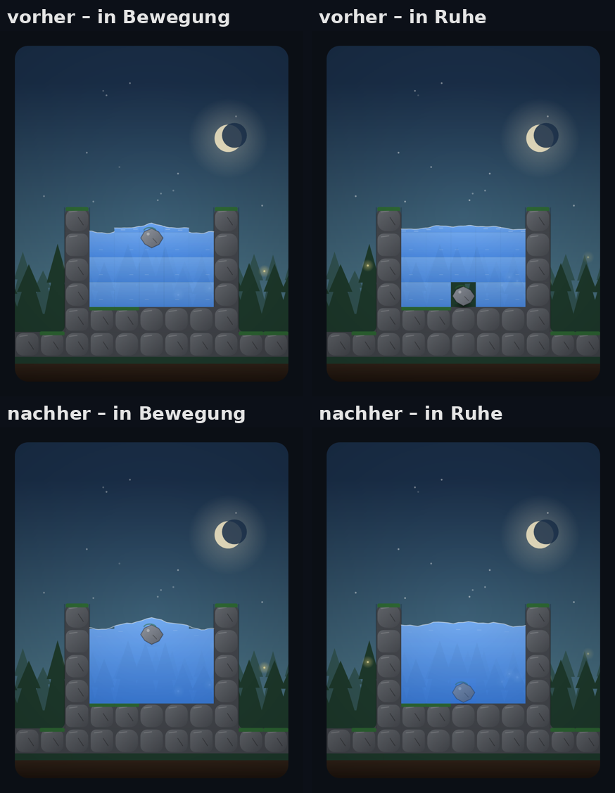
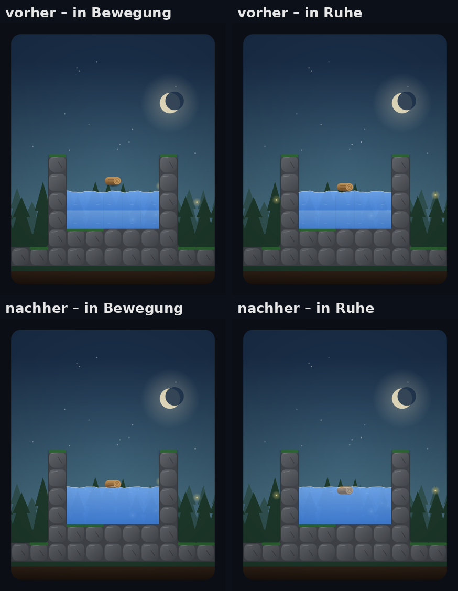
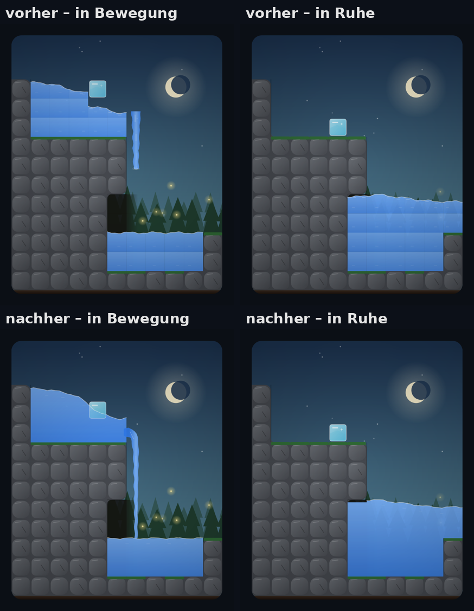
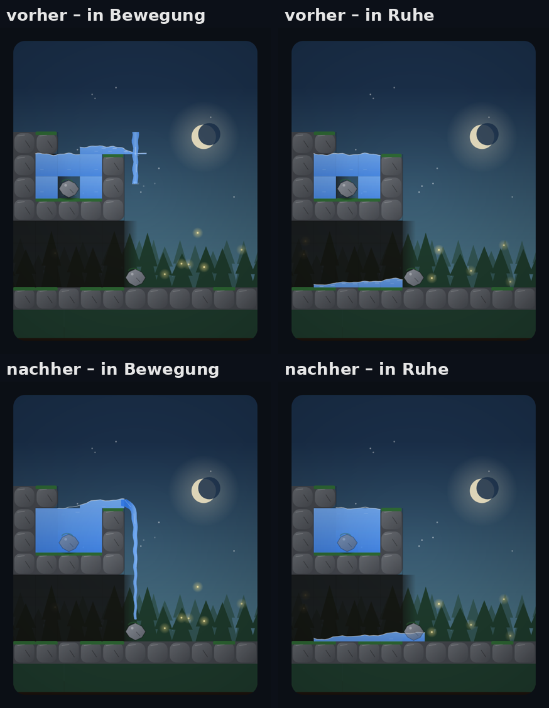
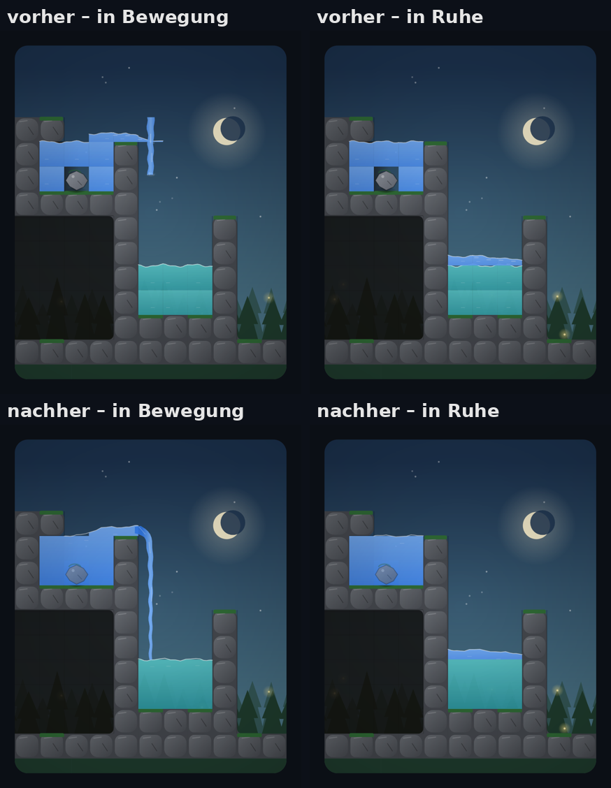
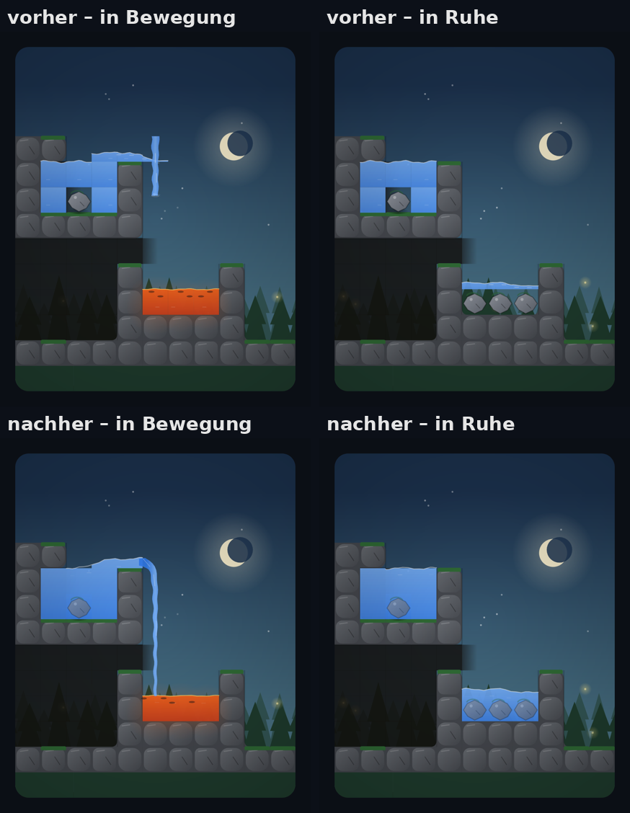

# Wasserdarstellung: vorher und nachher

Jedes Bild zeigt oben den alten, unten den neuen Renderer, links mitten in der Bewegung, rechts in Ruhe. Gerendert aus den Szenen in `app/src/test/resources/scenes` (dieselben Szenen fotografiert `WaterScenesTest` in der CI). Die Engine ist unverändert.

| Szene | Was sich sichtbar verbessert hat |
|---|---|
|  **Stein im Teich** | Vorher stand der Stein in Ruhe in einem Loch mit Himmel dahinter. Jetzt liegt er rundum im Wasser, ein heller Schleier liegt vor seinem eingetauchten Teil, und die Oberfläche läuft als eine glatte Linie über den ganzen Teich. |
|  **Holz schwimmt** | Vorher lag das Holz auf der Wasserlinie. Jetzt liegt es zur Hälfte im Wasser: Wasser dahinter, ein Schleier über der unteren Hälfte, die Wasserlinie läuft vor ihm weiter. |
|  **Wasserfall** | Vorher fiel ein loser Wasserstab, der vor dem Teich endete, und das Becken zerfiel in Zellstufen. Jetzt hängt ein durchgehender Strom an der Kante, biegt sich im Bogen über sie, wird nach unten schmaler und reicht bis in den Teich, wo er Wellen schlägt. |
|  **Wasser auf Stein** | Vorher Tropfen mit Spur. Jetzt läuft ein Strom bis auf den Stein, das Wasser fließt seitlich ab und fällt als gestreckte Tropfen weiter. |
|  **Meer unter Süßwasser** | Vorher zwei Schichten aus Kacheln mit Stufen. Jetzt liegt das Süßwasser als eigener Körper auf dem Meer, getrennt durch eine weiche Linie, und der Zulauf ist ein Strom statt Einzeltropfen. |
|  **Lava trifft Wasser** | Vorher klafften um die erstarrten Steine Löcher. Jetzt liegen die Steine im Wasser, das auf der erstarrten Lava steht. |

Außerdem, ohne eigenes Bild: Pegel folgen der Simulation zeitbasiert statt in Stufen (geglättet, unabhängig von den Simulationsschritten), fallendes Wasser beschleunigt, Aufprall auf Wasser erzeugt Ringe statt Spritzkreisen, auf festem Boden nur ein paar kleine Tropfen. Rückgängig, Wiederholen und Neustart setzen das Bild sofort.
